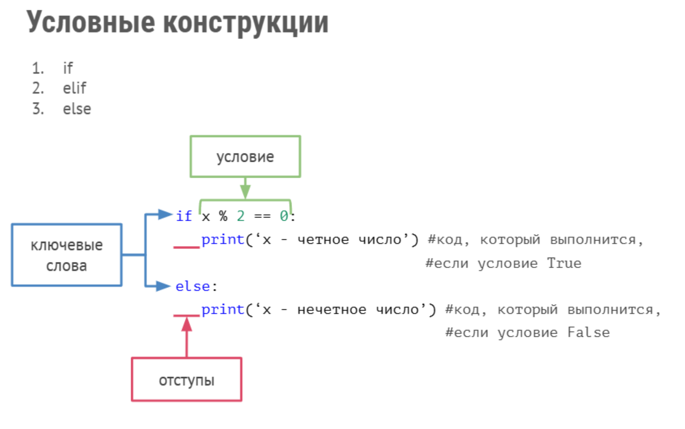
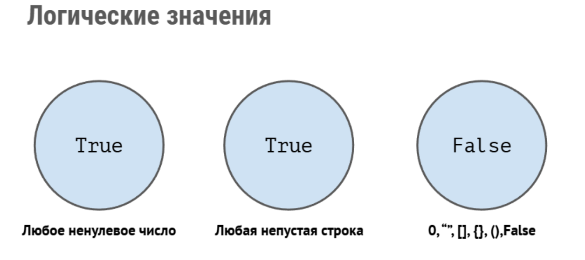

### Лекция 2

#### Операторы сравнения:
* больше a > b
* меньше a < b
* равно (не путать с =) a == b
* больше или равно a >= b
* меньше или равно a <= b
* не равно a != b

Pyton  может сравнивать не только цифры, но и строки.

* 'c' > 'a'  (true)
* 'b' > 'B'  (true)
* 'abc' > 'aba'  (true)

Каждый символ имеет свое цифровое значение, и чем дальше к алфавиту, тел он больше.

Добавление метода len('abc') > len('aba')  позволяет сравнивать строки по длине

#### Логические операторы
1. AND
   Логическое И – возвращает True, только когда оба операнда True
2. OR
   Логическое ИЛИ – возвращает True, когда хотя бы один операнд True
3. NOT
   Логическое НЕ – возвращает булево значение, противоположное операнду

#### Условные операторы


Пример кода (Вложенные условные конструкции) 
Программа определения вида войск для призывника сиходя из его возраста и роста
```
height = 182
age = 19

if 18 < age < 27:
   if height < 170:
      print('В танкисты')
   elif height < 200:
      print('В десантники')
   elif height < 185:
      print('На флот')
   else:
      print('В другие войска')
else:
   print('Непризывной возраст')   
```
Программа проводит расчет суммы первых трех чисел и последних трех. Если суммы равны - то билет является счастливым, если нет - то обычным.

% - выводит остаток от деления

// - делит без остатка
```
num = int(input("Enter a number ######: "))

num1 = num // 100000
num2 = num % 100000 // 10000
num3 = num % 10000 // 1000
num4 = num % 1000 // 100
num5 = num % 100 // 10
num6 = num % 10
print(num1, num2, num3, num4, num5, num6)
if num1 + num2 + num3 == num4 + num5 + num6:
    print("Lucky")
    print('Сумма первых трех цифр равна = ', num1 + num2 + num3)
    print('Сумма последних трех цифр равна = ', num4 + num5 + num6)
    print('Сумма первых трех цифр равна сумме последних трех цифр')
else:
    print("Not Lucky")
    print('Сумма первых трех цифр равна = ', num1 + num2 + num3)
    print('Сумма последних трех цифр равна = ', num4 + num5 + num6)
    print('Сумма первых трех цифр неравна сумме последних трех цифр')

```

#### Логические значения



