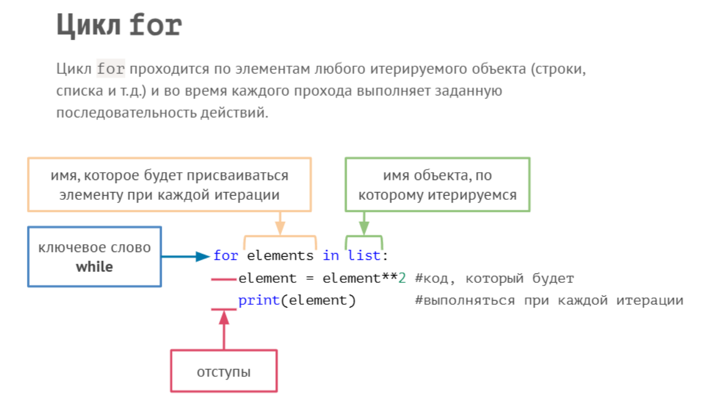

### Лекция 3 "Введение в типы данных и циклы"

#### Типы данных

1. Простые типы (тип данных можно уточнить с помощью метода type() - в отличие от java, в python нет указания типа данных перед переменной)
     * bool(boolen) - логический тип
     * int(integer) - целые числа
     * float - действительные числа (с плавающей точкой)
     * str(string) -  строки
       * методы:
         * .upper() - приводит строку к верхнему регистру
         * .lower() - приводит строку к нижнему регистру
         * .capitalize() - приводит первую букву к верхнему регистру
         * .replace('что заменить', 'на что заменить') - заменяет элемент в строке на указанный
         * len('my_string') - позволяет определить длину строки
         * умножение строки на число приводит к тому, строка повторяется указанное число раз
         * .split() - разделяет строку и создает список  => .join(['1', '2', '3', '4']) - объединяет список в строку.
          ```
         str = 'Завернутая, в лепешку, еда, есть, практически, в любой, стране мира.'
         print(str.split(','))
         => ['Завернутая', ' в лепешку', ' еда', ' есть', ' практически', ' в любой', ' стране мира.']
       
          ```
     

```
print(1 + Trye) выведет  ответ 2
print(1 + False) выведет  ответ 1

так как для python  Trye - это всегда 1, а False - всегда 0,  он сам преобразовал данное значение.
```
```
f  перед строкой позволяет добавлять внутрь строки переменные с  данными 
name = 'Коля'
age = 13
print (f'Меня зовут {name}. Я родился в {2020 - age} году.')

```

2. Списки (list) - структура данных для упорядоченного хранения объектов различных типов
    * Список инициируется с помощью [ ] и является изменяемым типом данных. 
    * Элементы в списке разделяются запятыми.
       * списки можно складывать
       * del(list[index]) - удаляет элемент списка по индексу
       * .remove(el) - удаляет указанны элемент из списка
       * .append(el) - позволяет добавить элемент в конец списка
       * .insert(index, элемент) - позволяет добавить элемент внутри списка после указанного элемента
       * .count(el) - считает количество вхождений элемента в список
       * .index(el) - позволяет узнать индекс элемента
       * .reverse() - разворачивает список
       * .sorted(list) - сортирует список 
    * Многомерные списки - это списки внутри списка


```
name_list = [] - пустой список
user_data = ['Петров', 'Николай', 'Иванович', 25]
print(user_data[-2])  => Иванович
print(user_data[-2][0])  => И
print(user_data[-2][-5])  => н
print(user_data[-3][0:3])  => Ник

user_data [1] = 'Семен' => 
user_data = ['Петров', 'Семен', 'Иванович', 25]
```
3. Кортежи(tuples) - это неизменяемые списки, в которых нельзя удалять или добавлять элементы. Инициализируется с помощью ().

```
user_data = ('Петров', 'Николай', 'Иванович', 25)

```
Функция zip - берет на вход несколько кортежей/списков и создает из них специальный zip-объект.


4. Циклы - позволяют организовать повторение выполнения участков кода. В Python существует два типа циклов: цикл while и цикл for.




```
company_name = 'Dinosaurus Inc.'
for letter in company_name:
    letter = letter.capitalize()
    print(letter, end='') 

=> D I N O S A U R U S   I N C .
```
```
companies_capitalisation = [
  ['Apple', 1000],
  ['Microsoft', 1246],
  ['Google', 874],
  ['Amazon', 1026]]

for company in companies_capitalisation:
  print(f"{company[0]}'s capitalisation is $ {company[1]}")
  =>
  Apple's capitalisation is $ 1000
  Microsoft's capitalisation is $ 1246
  Google's capitalisation is $ 874
  Amazon's capitalisation is $ 1026
```

```
phrase = '\"Пуаро Агаты Кристи\" — это детективный сериал, основанный на произведениях знаменитой британской писательницы Агаты Кристи. '

for letter in phrase:
  if letter == ' ':
    break
  print(letter, end='')
  
  => "Пуаро
  
  for letter in phrase:
  if letter == ' ':
    continue
  print(letter, end='')
  
  => "ПуароАгатыКристи"—этодетективныйсериал,основанныйнапроизведенияхзнаменитойбританскойписательницыАгатыКристи.
  
  for letter in phrase:
  if letter == ' ':
    pass
  print(letter, end='')
  
  => "Пуаро Агаты Кристи" — это детективный сериал, основанный на произведениях знаменитой британской писательницы Агаты Кристи.

```

Вложенные циклы
```
professions = ['IT', 'Физика', 'Математика']
persons = [
  ['Гейтс', 'Джобс','Возняк'],
  ['Эйнштейн', 'Фейнман'],
  ['Эвклид', 'Ньютон']
]
// вариант 1
for pro, names in zip(professions, persons):
  print(f'Professions: {pro}')
  for name in names:
    print(name)
  print()  

// вариант 2
list = list(zip(professions, persons))
for prof, person in list:
   print(f'Professions: {prof}')
   for pers in person:
       print(f'{pers}')
   print()   
   
=>
Professions: IT
Гейтс
Джобс
Возняк

Professions: Физика
Эйнштейн
Фейнман

Professions: Математика
Эвклид
Ньютон
```

* Словари
* Множества


### Индексация символов
Прямая от 0 в сторону увеличения, и Обратная от -1 в сторону уменьшения.


Получить значение элемента по индексу можно при помощи [ ]
* ```my_string[0]``` или  ```my_string[-6]```

Среза строк позволяет извлечь несколько элементов
* ```my_string[1:3]``` извлекает 2 и 3 элемент строки
* ```my_string[0:4:2]``` - третьим элементом указывается шаг - в данном случае будет выведен каждый второй элемент в промежутке от 0 до 4, то есть элемент 1 и 3
* ```my_string[3: ]``` - выведет все элементы от 3
* ```my_string[ :3]``` - выведет последние 3 элемента строки
* ```my_string[ ::-1]``` - перевернет строку от последнего символа в первому

