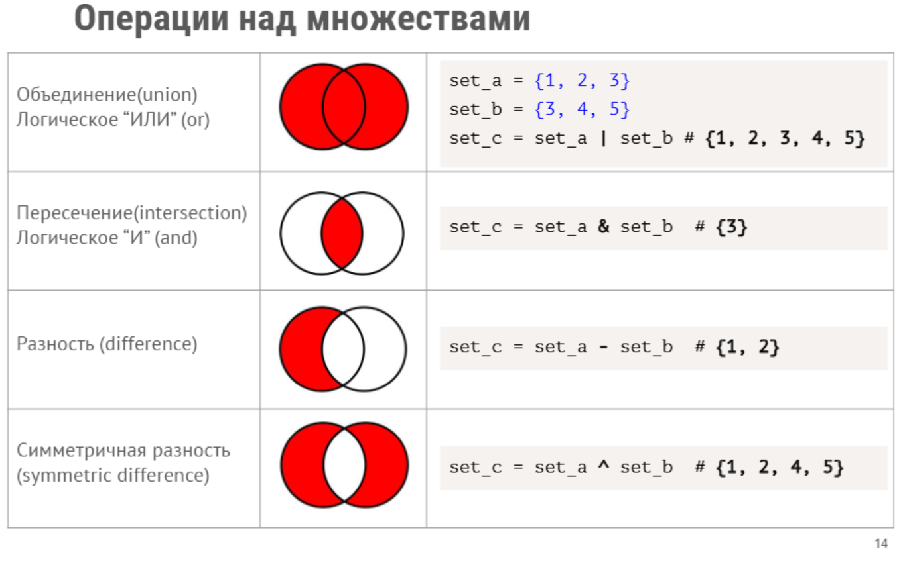

### Коллекции данных. Словари. Множества.

Словари (dictionaries) — неупорядоченные коллекции произвольных объектов с
доступом по ключу. Значением словаря может быть любой тип данных.
Элементы в словарях хранятся в формате key:value.

Словарь инициализируется при помощи функции dict() или {}
* del(dict[key]) удаляет элемент из списка по ключу;
* .keys() позволяет получить все ключи словаря;
* .values() позволяет получить все значения словаря;
* .items() позволяет получить ключи и значения словаря;
* .get(key) “безопасно” возвращает значение по ключу (при отсутствии ключа
ошибка не возникает) - на выходе появляется None;
* .setdefault(key, default) позволяет получить значение по ключу, автоматические
добавляет элемент в словарь, если его нет.
```
telephones_dict = dict()
capitals_dict = {}
```
```
Получение значения из словаря по ключу:
   capitals_dict = {'Russia': 'Moscow', 'Ukraine': 'Kiev'}
    print(capitals_dict['Russia'])
    
Итерация по словарю:
   for country, capital in capital_dict.items():
   print(country, ‘->’, capital)

Добавление нового элемента в словарь:
   capitals_dict['France'] = 'Paris'
```

#### Множества

Множества (sets) — «контейнер», содержащий неповторяющиеся элементы в
случайном порядке.

Множество инициализируется при помощи set(). Обычно создается из списков.

При создании множества, информация о составе списков обрабатывается и в множество добавляются только те, которые не повторяются.



Операции над множествами

* .add(el) добавляет элемент в множество;
* .update(set) соединяет множество с другим множеством/списком;
* .discard(el) удаляет элемент из множества по его значению;
* .union(set) объединяет множества (логическое “ИЛИ”);
* .intersection(set) — пересечение множеств (логическое “И”);
* .difference(set) возвращает элементы одного множества, которые не принадлежат другому множеству (разность множеств);
* .symmetric_difference(set) возвращает элементы, которые встречаются в одном
множестве, но не встречаются в обоих